# NETGEAR ASG1100

Branded both as NETGEAR and XFINITY.
Apparently it's a security gateway.
Perhaps the `SG` in `ASG1100`

This device is said to be part of the iControl Collaboration platform.

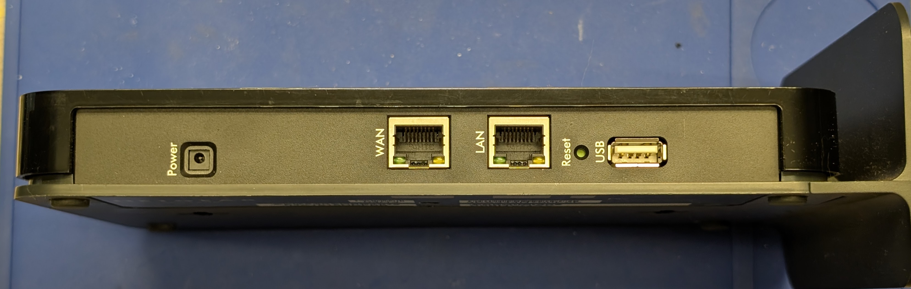

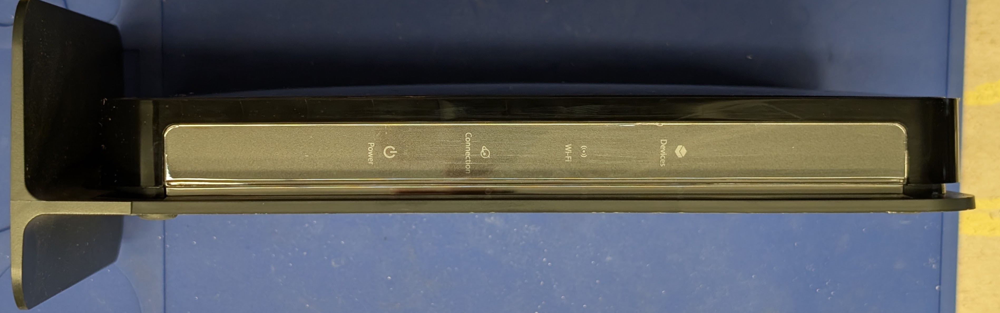

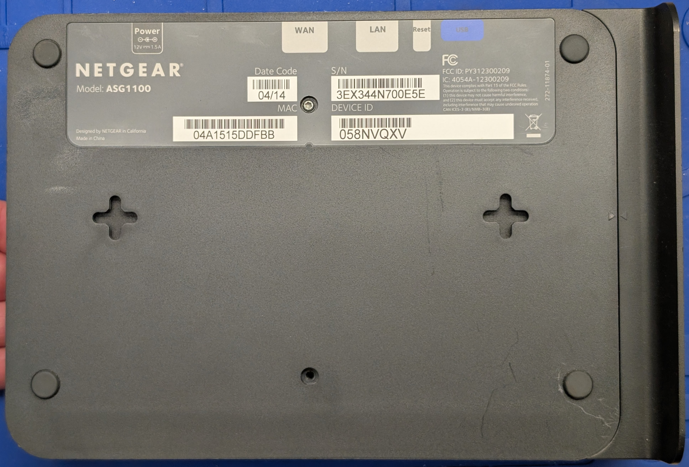

## Checklist

- [n/a] Reference materials
    - [n/a] Manufacturer docs
    - [n/a] Firmware updates
    - [n/a] Third-party references
- [x] Factory reset
- [x] External documentation
- [x] Internal documentation
- [ ] Dumped ROM

## Critical Info

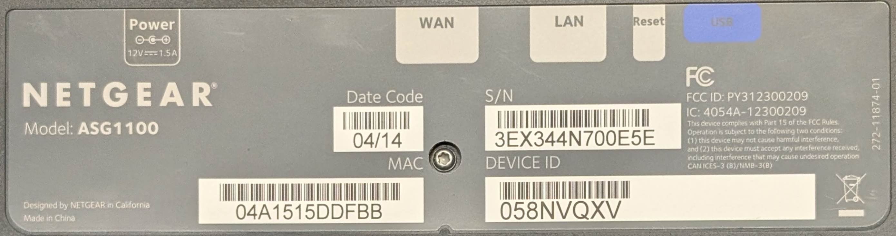

External label:

```text
NETGEAR
Model: ASG1100

Power -@+

Date Code: 04/14
MAC: 04A1515DDFBB
S/N: 3EX344N700E5E
DEVICE ID: 058NVQXV
```

## Reference material:

None, sadly.

## Board

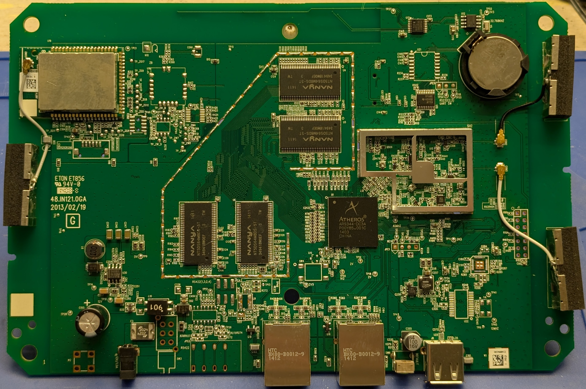

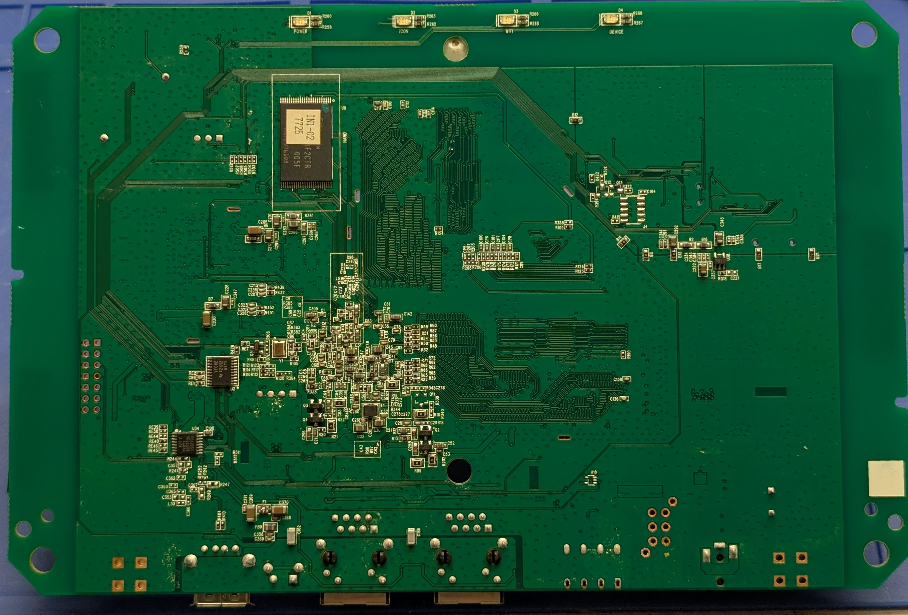

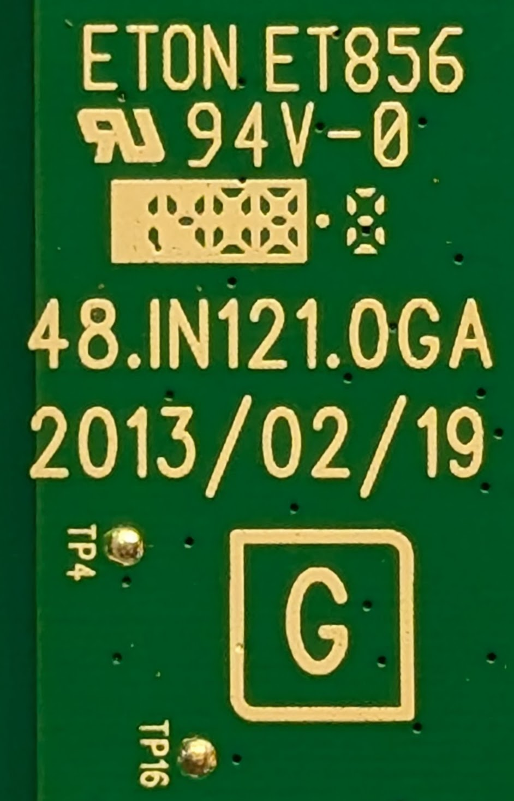

Markings:

```text
ETON ET856
RU 97V-0
1408*8
48.IN121.0GA
2013/02/19
[G]
```

Apparently, ETON is short for Ellington, a Chinese electronics manufacturer.

### U1 Atheros AR9344-DC3A MIPS 74Kc 802.11n SoC

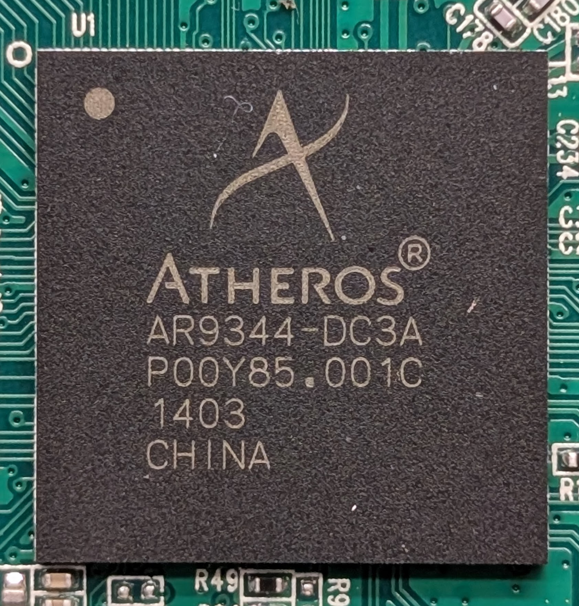

* [Datasheet](https://raw.githubusercontent.com/Deoptim/atheros/master/AR9344_May_2012.pdf)
* [Manufacturer page]()
* Package: BGA-409
* Markings:

```text
Atheros
AR9344-DC3A
P00Y85.001C
1403
CHINA
```

### U2 Texas Instruments TXS0108EPWR Octal BiDi Level Shifter

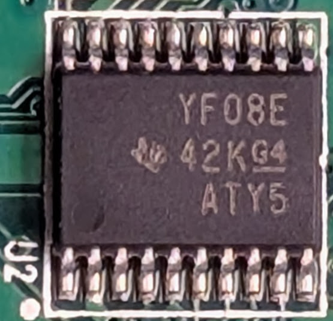

* [Datasheet](https://www.ti.com/lit/ds/symlink/txs0108e.pdf)
* [Manufacturer page](https://www.ti.com/lit/gpn/TXS0108E-Q1)
* Package: TSSOP-20
* Markings:

```text
YF08E
```

### U4-7 Nanya NT5DS64M8DS-5T 512 Mib DDR SDRAM

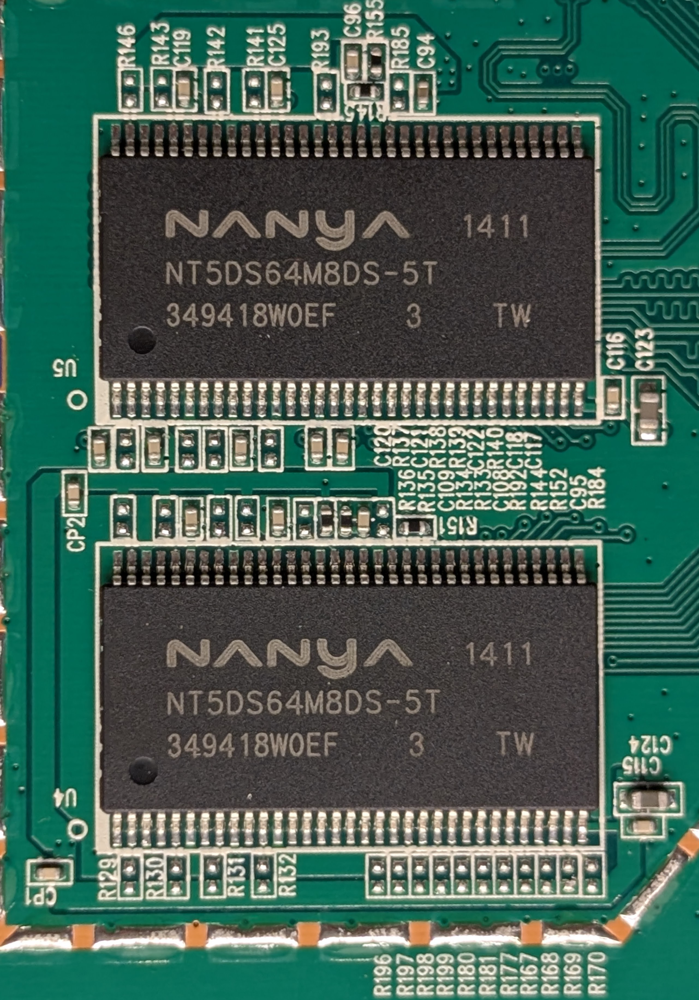

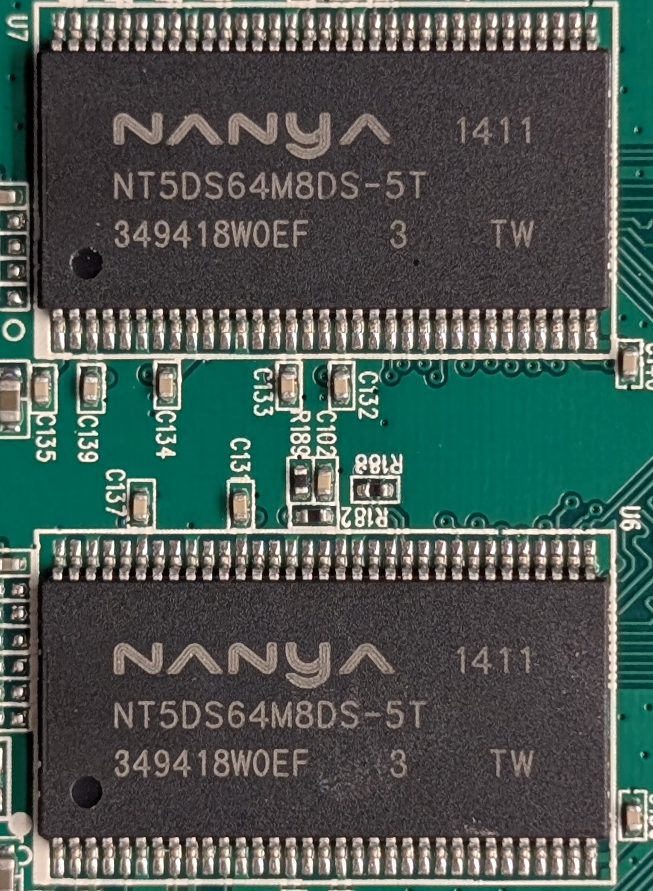


* [Datasheet](https://datasheet.octopart.com/NT5DS64M8DS-5T-Nanya-datasheet-180870502.pdf)
* [Manufacturer page]()
* Package: TSSOP-66 (Type II)
* Markings:

```text
NANYA           1411
NT5DS64M8DS-5T
349418W0EF  3   TW
```

Total of 256 MiB of DDR SDRAM


* [Datasheet](https://datasheet.octopart.com/NT5DS64M8DS-5T-Nanya-datasheet-180870502.pdf)
* [Manufacturer page]()
* Package: TSSOP-66 (Type II)
* Markings:

```text
NT5DS64M8DS-5T
```

### U8 SK hynix H27U2G8F2CTR-BC 2 Gib Parallel NAND Flash

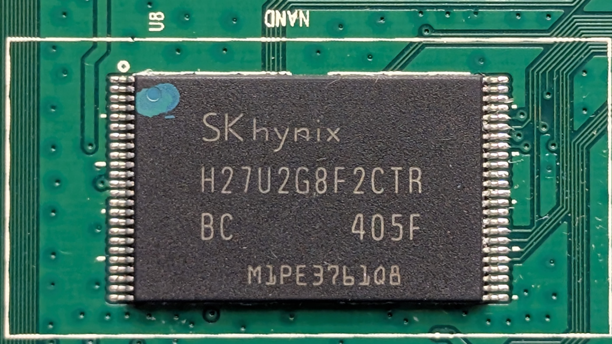

* [Datasheet](https://datasheet4u.com/pdf/1491686/H27U2G8F2CTR.pdf)
* [Manufacturer page]()
* Package: TSOP-48 (Type I)
* Markings:

```text
SKhynix
H27U2G8F2CTR
BC      405F
 M1PE3761QB
```

### U10 Texas Instruments TXS0108EPWR Octal BiDi Level Shifter

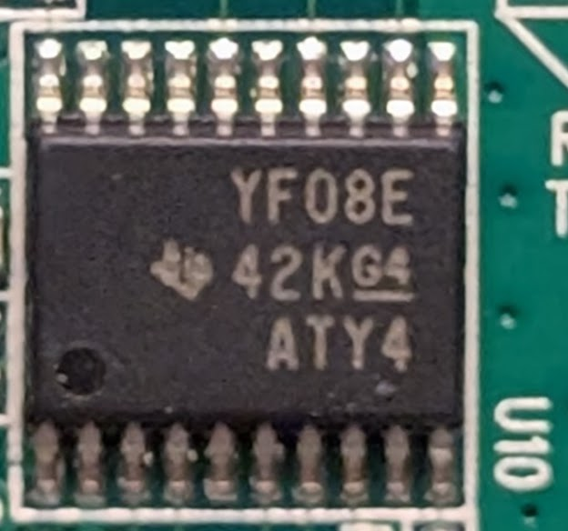

* [Datasheet](https://www.ti.com/lit/ds/symlink/txs0108e.pdf)
* [Manufacturer page](https://www.ti.com/lit/gpn/TXS0108E-Q1)
* Package: TSSOP-20 (Type I)
* Markings:

```text
YF08E
```

### U12 Intersil ISL1208 Real-Time Clock


* [Datasheet](https://www.renesas.com/en/document/dst/isl1208-datasheet)
* [Manufacturer page](https://www.renesas.com/en/products/isl1208)
* Package: SOIC-8 (Narrow)
* Markings:

```text
1208
```

Paired with Y3 32.768 KHz crystal oscillator adjacent.

### U13 NXP PCA9951 8-bit I2C LED Driver

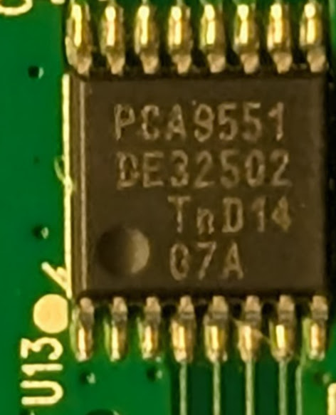

* [Datasheet](https://www.nxp.com/docs/en/data-sheet/PCA9551.pdf)
* [Manufacturer page](https://www.nxp.com/products/power-drivers/lighting-driver-and-controller-ics/led-drivers/8-bit-ic-bus-led-driver-with-programmable-blink-rates:PCA9551)
* Package: TSSOP-16
* Markings:

```text
PCA9951
DE32502
  TnD14
  G7A
```

Appears to drive the front LEDs.

### U26 Microchip LX5535LQ 2.4 GHz Power Amplifier

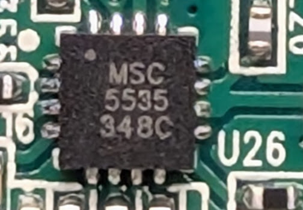

* [Datasheet](https://ww1.microchip.com/downloads/en/DeviceDoc/mic5353.pdf)
* [Manufacturer page](https://www.microchip.com/en-us/product/lx5535)
* Package: MLPQ-16
* Markings:

```text
MSC 5535
```

Probably drives the WiFi.

### U30 Texas Instruments TPS54331 3 A Step-Down Voltage Regulator

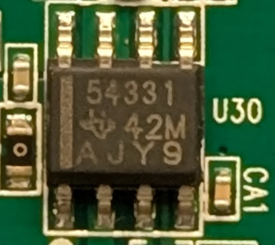

* [Datasheet](https://www.ti.com/lit/ds/symlink/tps54331.pdf)
* [Manufacturer page](https://www.ti.com/product/TPS54331)
* Package: SOIC-8
* Markings:

```text
54331
  42M
AJY9
```

### U30 Texas Instruments TPS54331 3 A Step-Down Voltage Regulator


* [Datasheet](https://www.ti.com/lit/ds/symlink/tps54331.pdf)
* [Manufacturer page](https://www.ti.com/product/TPS54331)
* Package: SOIC-8
* Markings:

```text
54331
```

Probably for the whole board.

### U34 NXP PCA9951 8-bit I2C LED Driver

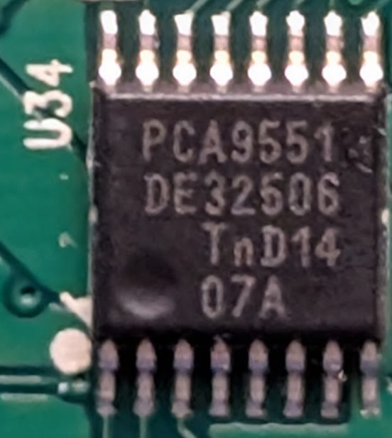

* [Datasheet](https://www.nxp.com/docs/en/data-sheet/PCA9551.pdf)
* [Manufacturer page](https://www.nxp.com/products/power-drivers/lighting-driver-and-controller-ics/led-drivers/8-bit-ic-bus-led-driver-with-programmable-blink-rates:PCA9551)
* Package: TSSOP-16
* Markings:

```text
PCA9951
```

"### U34 NXP PCA9951 8-bit I2C LED Driver


* [Datasheet](https://www.nxp.com/docs/en/data-sheet/PCA9551.pdf)
* [Manufacturer page](https://www.nxp.com/products/power-drivers/lighting-driver-and-controller-ics/led-drivers/8-bit-ic-bus-led-driver-with-programmable-blink-rates:PCA9551)
* Package: TSSOP-16
* Markings:

```text
PCA9951
```

Another LED driver/GPIO expander.
I don't think this one is near the LEDs.

## Firmware

### Boot Process

This boot might have been weird,
because I had done the factory reset previously.

* [Saleae Logic capture](log/boot.sal)
* [Transcript](log/boot_JPE1.txt)

Apparent level-0 bootloader:

```text
WASP BootROM Ver. 1.3
```

Level 1 bootloader is not named, but does something.

Then U-Boot:

```text
U-Boot 1.1.9.1 (Mar  5 2013 - 16:33:55)
...
Hit any key to stop autoboot:  0
```

It looks like U-Boot has access to NAND and the various IO subsystems, and is interruptible.
It stands to reason that we could dump the NAND here.

And eventually, we load the Linux kernel:

```text
Loading from device 0: ath-nand (offset 0x80000)
   Image Name:   MIPS OpenWrt Linux-2.6.31
```

## Conclusion: Hackable

I don't have the time to get further into this right now,
but the device looks pretty hackable.
I didn't get a root console, but I did get a U-Boot console,
which is arguably just as good.